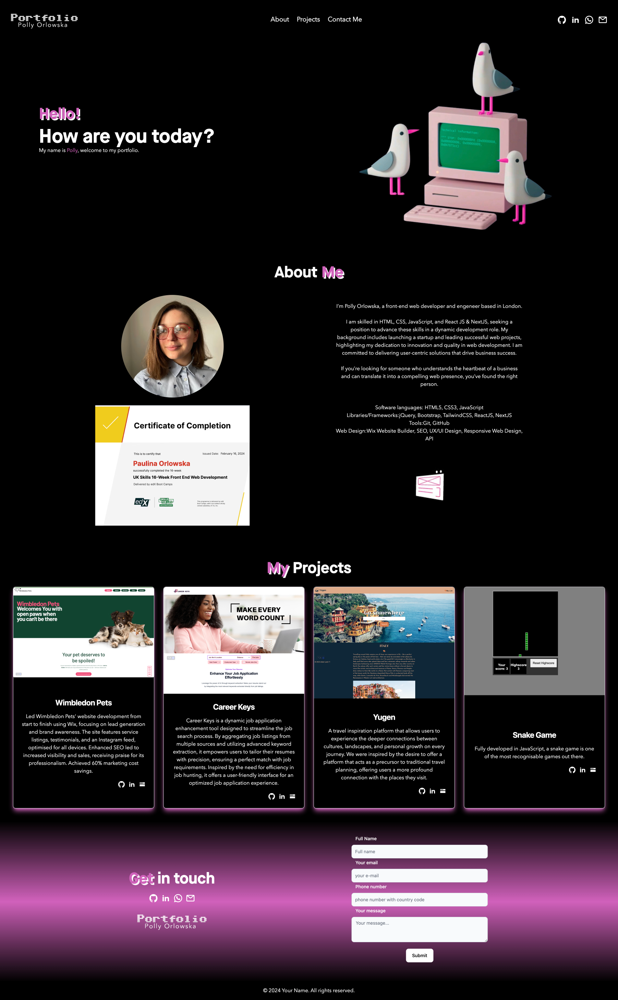

# Porlowska - portfolio

[Portfolio](https://porlowska.netlify.app/)

## Description

As a passionate web developer, I created a portfolio to showcase my technical skills and provide an engaging experience for potential recruiters. Built with React JS, Next JS, and JavaScript, and hosted on Netlify, this site highlights my projects and design process. It aims to demonstrate my skills in front-end technologies and deliver user-friendly web solutions. As a passionate web developer, I created a portfolio to showcase my technical skills and provide an engaging experience for potential recruiters. Built with React JS, Next JS, and JavaScript, and hosted on Netlify, this site highlights my projects and design process. It aims to demonstrate my skills in front-end technologies and deliver user-friendly web solutions.

## Installation

Application responsive design allows it to be viewed in any browser, on any device.

To access the webpage please follow [THIS LINK](https://porlowska.netlify.app/).

## Usage

This application is used to showcase skills and projects to future employers or colleagues, as well as it is an easily accessible place to store any showcase worth project.

## Credits

## License

None
